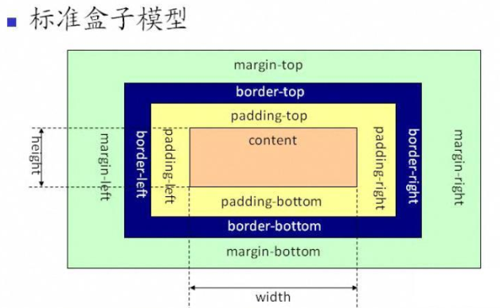

<!-- 
* 该文件是子目录的路由默认页
* 默认不显示目录，可以设置开启侧边栏的目录显示，该文件的目录会显示在侧边栏
* 侧边栏默认显示的一级目录，是通过根目录的_sidebar.md文件定义的。
* 嵌套目录显示是从二级目录开始的，subMaxLevel: 5 能够显示到四级目录
-->

# CSS
> 教程参考：[MDN](https://developer.mozilla.org/zh-CN/docs/Learn/CSS)、 [菜鸟教程](https://www.runoob.com/css/css-tutorial.html)、[W3school](https://www.w3school.com.cn/css/index.asp)

## 初识
* 层叠样式表 `CSS(cascading style sheet)`
* 用来修饰网页，相对于网页的化妆师

## CSS引入方式
* 行内样式
* 内部样式
* 外部样式

### 行内样式
* 给标签添加`style`属性
* 在`style`内书写相关的具体修饰
* **注意**`style`里面的就是`css`，语法就是:`属性:属性值;`

```html
  <div style="color:red;"></div>
```


### 内部样式
* 在`head`中创建`<style type="text/css"></style>`标签，`type="text/css"`可以省略
* 在`style`标签中书写具体的`css`修饰
* **注意**
  - 书写想要修饰的对象{ 属性:属性值；}
  - 选择器（选择符）{ 属性:属性值；}
  - 选择器{声明}

```html
  <style type="text/css">
    div {
      color: red;
    }
  </style>

  <div></div>
```


### 外部样式
* 在外部创建一个`.css`后缀的文件，如`index.css`
* 直接在`css`文件中修饰样式即可
* **注意**
  - 书写想要修饰的对象{ 属性:属性值；}
  - 选择器（选择符）{ 属性:属性值；}
  - 选择器{ 声明 }，
  - PS: `属性:属性值；`也叫`声明`；`要修饰的对象`也叫`选择器（选择符）`

* 通过`link`或者`import`把`html`文件和`css`文件进行连接
  - `link`连接、`rel`定义关联、`stylesheet`样式表、`rel="icon"`浏览器状态栏图标
  ```html
    <link href="" rel="stylesheet" type="text/css">
  ```

  - 在`html`文件中的`style`标签里，使用`@import url();`引入`CSS`文件
  ```html
    <style> @import url(); </style>
  ```

#### `link`和`import`之间的区别
* 本质区别：`link`属于`html`标签，而`import`是`CSS`的一种引入方式
* 加载顺序：
  - `link`是与`HTML`结构和`CSS`样式，同时加载的
  - `import`是先加载`HTML`结构，最后加载`CSS`样式

* 兼容性：
  - `link`没有兼容性问题
  - `import`是`css2.1`提出，对于`IE5`以下的浏览器不兼容

* `DOM`不能控制`@import`引入的样式


## CSS选择器
* 可以利用选择器，选择到想要修饰的对象

### 选择器的分类
* 基本选择器
* 属性选择器
* 伪类选择器
* 伪元素选择器
* 层次选择器


### 基本选择器
* 标签选择器（类型选择器）
  - 语法：`标签{}` 例如：`div{}`、`p{}`
  - 实现：`div{}` 指定的就是所有的`div`执行样式

* class选择器（类选择器）
  - 语法：`.class名字{}` 例如：`.box{}`
  - 实现：指定具有`class名字`的标签执行样式
  - 注意：`class`的属性值，可以给多个，中间用`空格`隔开，如：`class="box1 t1"`

* id选择器
  - 语法：`#id名字{}` 例如：`#box{}`
  - 实现：指定具有`id名字`的标签执行样式
  - 特点：具有唯一性

* 通配符
  - 语法：`*{}`
  - 实现：让`所有的标签`都执行样式

* 群组选择器
  - 语法：`某某1,某某2,某某3{}`
  - 实现：让`指定这些标签`执行一样的样式

* 后代选择器
  - 语法：`某某1 某某2{}`
  - 实现：可以选择到某个父元素下面的所有的子元素
  - 注意：权重值同群组选择器，是求和

### 选择器的权重
* 是衡量一个选择器占比大小的值
* 权重值
  - `div{}`类型选择器，权重值`0001`
  - `.box{}`class选择器，权重值`0010`
  - `#box{}`id选择器，权重值`0100`
  - `*{}`通配符，权重值`0000`
  - `.box,p,.t1{}`群组选择器，整体无权重，需合并计算，权重值`10+1+10=21`
  - `行内样式表（内联样式）`，权重是`1000`

### CSS样式冲突之后的，解析规则
* 权重不相同，谁的权重高，就解析谁
* 权重相同，哪个选择符最后定义，就采用哪个选择符样式（就近原则）


## CSS常用属性

* 宽度  `width`
* 高度  `height`
* 文字大小  `font-size`
* 文字颜色  `color`
* 背景颜色  `background-color`

* 高级属性
  - 布局,浮动`float`
  - 间距，外间距`margin`、内间距`padding`
  - 边框，`border`
  - 文本，`font`、`text-decoration`、`text-indent`···


### 浮动
* 使用场景：想要竖着的横过去就可以用
* 页面布局使用浮动，常用属性：
  - `float:none;` 默认值
  - `float:left;` 向左浮动
  - `float:right;` 向右浮动

* 特点：
  - 一个盒子浮动了之后，该盒子是原地悬空不占位置
    - 当一个元素不在文档流中占据空间，而是漂浮在文档流的上方的时候，叫做`脱离文档流`
  - 后面没有浮动的盒子会上去，但后面盒子的内容会环绕浮动盒子显示
    - 起初设计浮动，是为了实现文字环绕效果

* 多个盒子同时浮动，会横向排列
  - 如果同时添加了`float:left;`，从左往右
  - 如果同时添加了`float:right;`，从右往左
  - 如果同时有的添加了`float:left;`有的添加了`float:right;`；那么左边的靠左，右边靠右

#### 高度塌陷
  - 在包含结构的时候，如果父元素没有设置高度
  - 且所有的子元素都浮动了，那么此时因为子元素浮动不占位
  - 所以现在父元素的高度是0，这个现象叫做高度塌陷
  - 解决方法：
    - 给父元素添加高度
    - 给塌陷的元素的添加`overflow: hidden;`
    - 更多方法请参阅`CSS拓展`之[清除浮动的8种方法](base/css/ext.md)


### CSS的盒模型
* 分类: 外间距`margin`、内间距`padding`
* 需要引入`盒模型`概念
  - 盒模型组成：`magin` + `border` + `padding` + `content`
  - W3C标准盒模型，宽度=`content`
  - IE怪异盒模型，宽度=`border` + `padding` + `content`




### 外间距
* 当需要的间距相对于盒子来说，是外面的时候，使用 外间距`margin`
* 当需要的间距相对于盒子来说，是里面的时候，使用 外间距`padding`

* 用法
  - 单独设置，`margin-top`、`margin-bottom`、`margin-left`、`margin-right`
  - 简写`margin: 20px;`，1个值是四个方向，2个值是上下左右，3个值是上左右下，4个值是上右下左
  - `margin`的属性值如果是负数，那么实现的效果，跟正数是相反的
  - `margin`的属性值是`auto`，就是把剩余的空间，给到指定的方向上

* 奇技淫巧
  - 一个有宽度的盒子水平居中，常用：`margin: 0 auto;` 
  - 把剩余的所有空间给到左边，`margin-left: auto;` 


#### margin-top的传递问题
* 在包含结构里面，如果给子元素设置了`margin-top`
* 应该是子元素自己下来，但是浏览器解析的时候，父元素也会下来

* 解决方法
  - 给父元素添加`border-top: 1px solid transparent;`
  - 给父元素添加`overflow: hidden;`
  - 给父元素或者子元素添加浮动


#### margin的上下重叠问题
* 在并列结构里面，如果给上面的盒子添加了`margin-bottom`,给下面的盒子添加了`margin-top`
* 那么间距应该是两者之和，但浏览器解析时，会显示最大数值的间距

* 解决方法
  - 给下面的盒子添加父元素，并给父元素添加`overflow: hidden;`


### 内间距
* 当需要的间距相对于盒子来说，是里面的时候，使用 内间距`padding`


