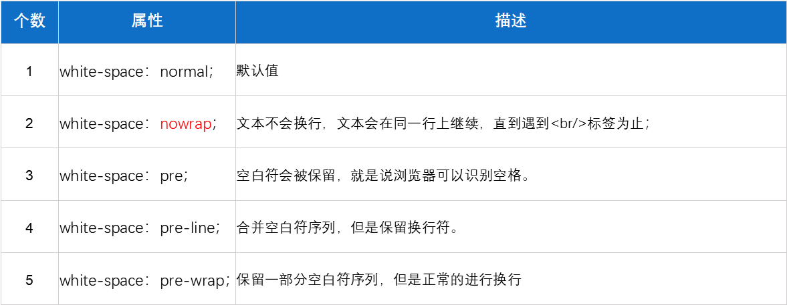
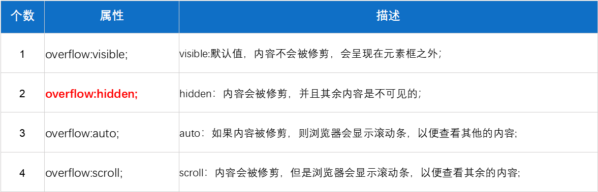

<!-- 
* 该文件是子目录的路由默认页
* 默认不显示目录，可以设置开启侧边栏的目录显示，该文件的目录会显示在侧边栏
* 侧边栏默认显示的一级目录，是通过根目录的_sidebar.md文件定义的。
* 嵌套目录显示是从二级目录开始的，subMaxLevel: 5 能够显示到四级目录
-->

# CSS
> 教程参考：[MDN](https://developer.mozilla.org/zh-CN/docs/Learn/CSS)、 [菜鸟教程](https://www.runoob.com/css/css-tutorial.html)、[W3school](https://www.w3school.com.cn/css/index.asp)

## 初识
* 层叠样式表 `CSS(cascading style sheet)`
* 用来修饰网页，相对于网页的化妆师

## CSS引入方式
* 行内样式
* 内部样式
* 外部样式

### 行内样式
* 给标签添加`style`属性
* 在`style`内书写相关的具体修饰
* **注意**`style`里面的就是`css`，语法就是:`属性:属性值;`

```html
  <div style="color:red;"></div>
```


### 内部样式
* 在`head`中创建`<style type="text/css"></style>`标签，`type="text/css"`可以省略
* 在`style`标签中书写具体的`css`修饰
* **注意**
  - 书写想要修饰的对象{ 属性:属性值；}
  - 选择器（选择符）{ 属性:属性值；}
  - 选择器{声明}

```html
  <style type="text/css">
    div {
      color: red;
    }
  </style>

  <div></div>
```


### 外部样式
* 在外部创建一个`.css`后缀的文件，如`index.css`
* 直接在`css`文件中修饰样式即可
* **注意**
  - 书写想要修饰的对象{ 属性:属性值；}
  - 选择器（选择符）{ 属性:属性值；}
  - 选择器{ 声明 }，
  - PS: `属性:属性值；`也叫`声明`；`要修饰的对象`也叫`选择器（选择符）`

* 通过`link`或者`import`把`html`文件和`css`文件进行连接
  - `link`连接、`rel`定义关联、`stylesheet`样式表、`rel="icon"`浏览器状态栏图标
  ```html
    <link href="" rel="stylesheet" type="text/css">
  ```

  - 在`html`文件中的`style`标签里，使用`@import url();`引入`CSS`文件
  ```html
    <style> @import url(); </style>
  ```

#### `link`和`import`之间的区别
* 本质区别：`link`属于`html`标签，而`import`是`CSS`的一种引入方式
* 加载顺序：
  - `link`是与`HTML`结构和`CSS`样式，同时加载的
  - `import`是先加载`HTML`结构，最后加载`CSS`样式

* 兼容性：
  - `link`没有兼容性问题
  - `import`是`css2.1`提出，对于`IE5`以下的浏览器不兼容

* `DOM`不能控制`@import`引入的样式


## CSS选择器
* 可以利用选择器，选择到想要修饰的对象

### 选择器的分类
* 基本选择器
* 属性选择器
* 伪类选择器
* 伪元素选择器
* 层次选择器


### 基本选择器
* 标签选择器（类型选择器）
  - 语法：`标签{}` 例如：`div{}`、`p{}`
  - 实现：`div{}` 指定的就是所有的`div`执行样式

* class选择器（类选择器）
  - 语法：`.class名字{}` 例如：`.box{}`
  - 实现：指定具有`class名字`的标签执行样式
  - 注意：`class`的属性值，可以给多个，中间用`空格`隔开，如：`class="box1 t1"`

* id选择器
  - 语法：`#id名字{}` 例如：`#box{}`
  - 实现：指定具有`id名字`的标签执行样式
  - 特点：具有唯一性

* 通配符
  - 语法：`*{}`
  - 实现：让`所有的标签`都执行样式

* 群组选择器
  - 语法：`某某1,某某2,某某3{}`
  - 实现：让`指定这些标签`执行一样的样式

* 后代选择器
  - 语法：`某某1 某某2{}`
  - 实现：可以选择到某个父元素下面的所有的子元素
  - 注意：权重值同群组选择器，是求和

### 选择器的权重
* 是衡量一个选择器占比大小的值
* 权重值
  - `div{}`类型选择器，权重值`0001`
  - `.box{}`class选择器，权重值`0010`
  - `#box{}`id选择器，权重值`0100`
  - `*{}`通配符，权重值`0000`
  - `.box,p,.t1{}`群组选择器，整体无权重，需合并计算，权重值`10+1+10=21`
  - `行内样式表（内联样式）`，权重是`1000`

### CSS样式冲突之后的，解析规则
* 权重不相同，谁的权重高，就解析谁
* 权重相同，哪个选择符最后定义，就采用哪个选择符样式（就近原则）


## CSS常用属性

* 宽度  `width`
* 高度  `height`
* 文字大小  `font-size`
* 文字颜色  `color`
* 背景颜色  `background-color`

## CSS高级属性
* 布局，浮动`float`
* 间距，外间距`margin`、内间距`padding`
* 边框，`border`
* 文本，`font`、`text-decoration`、`text-indent`···
* 列表，`list-style`
* 背景，`background`


### 浮动
* 使用场景：想要竖着的横过去就可以用
* 页面布局使用浮动，常用属性：
  - `float:none;` 默认值
  - `float:left;` 向左浮动
  - `float:right;` 向右浮动

* 特点：
  - 一个盒子浮动了之后，该盒子是原地悬空不占位置
    - 当一个元素不在文档流中占据空间，而是漂浮在文档流的上方的时候，叫做`脱离文档流`
  - 后面没有浮动的盒子会上去，但后面盒子的内容会环绕浮动盒子显示
    - 起初设计浮动，是为了实现文字环绕效果

* 多个盒子同时浮动，会横向排列
  - 如果同时添加了`float:left;`，从左往右
  - 如果同时添加了`float:right;`，从右往左
  - 如果同时有的添加了`float:left;`有的添加了`float:right;`；那么左边的靠左，右边靠右

#### 高度塌陷
  - 在包含结构的时候，如果父元素没有设置高度
  - 且所有的子元素都浮动了，那么此时因为子元素浮动不占位
  - 所以现在父元素的高度是0，这个现象叫做高度塌陷
  - 解决方法：
    - 给父元素添加高度
    - 给塌陷的元素的添加`overflow: hidden;`
    - 更多方法请参阅`CSS拓展`之[清除浮动的8种方法](base/css/ext.md)


### CSS的盒模型
* 分类: 外间距`margin`、内间距`padding`
* 需要引入`盒模型`概念
  - 盒模型组成：`magin` + `border` + `padding` + `content`
  - W3C标准盒模型，宽度=`content`
  - IE怪异盒模型，宽度=`border` + `padding` + `content`


### 外间距
* 当需要的间距相对于盒子来说，是外面的时候，使用 外间距`margin`

* 用法
  - 单独设置，`margin-top`、`margin-bottom`、`margin-left`、`margin-right`
  - 简写`margin: 20px;`，1个值是四个方向，2个值是上下左右，3个值是上左右下，4个值是上右下左
  - `margin`的属性值如果是负数，那么实现的效果，跟正数是相反的
  - `margin`的属性值是`auto`，就是把剩余的空间，给到指定的方向上

* 奇技淫巧
  - 一个有宽度的盒子水平居中，常用：`margin: 0 auto;` 
  - 把剩余的所有空间给到左边，`margin-left: auto;` 


#### margin-top的传递问题
* 在包含结构里面，如果给子元素设置了`margin-top`
* 应该是子元素自己下来，但是浏览器解析的时候，父元素也会下来

* 解决方法
  - 给父元素添加`border-top: 1px solid transparent;`
  - 给父元素添加`overflow: hidden;`
  - 给父元素或者子元素添加浮动


#### margin的上下重叠问题
* 在并列结构里面，如果给上面的盒子添加了`margin-bottom`,给下面的盒子添加了`margin-top`
* 那么间距应该是两者之和，但浏览器解析时，会显示最大数值的间距

* 解决方法
  - 给下面的盒子添加父元素，并给父元素添加`overflow: hidden;`


### 内间距
* 当需要的间距相对于盒子来说，是里面的时候，使用 内间距`padding`

* 用法
  - 单独设置，`padding-top`、`padding-bottom`、`padding-left`、`padding-right`
  - 简写`padding: 20px;`，1个值是四个方向，2个值是上下左右，3个值是上左右下，4个值是上右下左
  - `padding`的属性值不能给负数，也不能是`auto`

* **注意** `padding`是添加在盒子里面的，会把盒子撑大，解决方法:
    - 在设置宽度或者高度上减去添加的`padding`值
    - 给当前的盒子添加`box-sizing: border-box;`设置为怪异盒子


### 边框属性
* 单独设置
  - 边框宽度`border-width`
  - 边框颜色`border-color`
  - 边框线型号`border-style`，实线`solid`、虚线`dashed`、点状线`dotted`、双线`double`


* 简写
  - 全边框设置，顺序可换。
```
  border: 边框颜色 边框宽度 边框线型;
```
  - 单独设置
```
  border-top: 1px solid blue;
  border-bottom: 1px solid blue;
  border-left: 1px solid blue;
  border-right: 1px solid blue;
```


### 文本属性

#### 文字大小
* 浏览器默认的大小 `font-size: 16px;`
  - `1em=16px`
  - `12pt=16px`

* 设置文字大小 &lt; 12px
  - 先设置文字大小的2倍，如：`font-size: 20px;`
  - 将字体缩放0.5倍，`transform: scale(0.5);`，可得到`10px`的字体


#### 文字颜色
```html
  color: red; <!-- 颜色名字 -->
  color: #ff734c; <!-- 十六进制 -->
  color: #ff734c; <!-- 十六进制 -->
  color: rgba(255,0,0,0.5); <!-- rgb/rgba  a:alpha 透明度 -->
```


#### 文字字体
* 如果书写多个字体，首先解析第1个
* 第1个没有，会解析第2个，依次类推，如果都没有解析默认的
  - 谷歌和火狐浏览器默认字体是`微软雅黑`
  - `IE`以及其他浏览器默认是`宋体`

```html
  font-family: "楷体", "宋体"; <!-- 十六进制 -->
```


#### 字体加粗
* 单词
```html
  font-weight: bolder;  <!-- 加粗程度比较大 -->
  font-weight: bold;    <!-- 加粗 -->
  font-weight: normal;  <!-- 不加粗 -->
```

* 数字
```html
  font-weight: 100-500;  <!-- 不加粗 -->
  font-weight: 600-900;  <!-- 加粗 -->
```


#### 倾斜
```html
  font-style: normal;   <!-- 不倾斜 -->
  font-style: italic;   <!-- 倾斜 -->
  font-style: oblique;  <!-- 倾斜 -->
```


#### 水平对齐
* 通用

```html
  text-align: left; <!-- 水平靠左 -->
  text-align: right; <!-- 水平靠右 -->
  text-align: center; <!-- 水平靠中 -->
  text-align: justify; <!-- 水平两端对齐，只对多行起作用 -->
```

* 设置最后一行的对齐方式

```html
  text-align-last: left;     <!-- 水平靠左 -->
  text-align-last: right;    <!-- 水平靠右 -->
  text-align-last: center;   <!-- 水平靠中 -->
  text-align-last: justify;  <!-- 水平两端对齐，只对最后一行起作用，仅一行也行 -->
```


#### 行高
* 可以设置文本垂直的位置
* 用法：`line-height: 300px;`、`line-height: 4;`、`line-height: 500%;`
  
* `line-height: 300px;`
  - 如果没有`height`，直接书写`line-height`，可以实现单行文本在容器内部是垂直居中
  - 如果有`height`，再书写`line-height`
    - `line-height` = `height`，单行文本垂直居中
    - `line-height` &gt; `height`，单行文本垂直居下
    - `line-height` &lt; `height`，单行文本垂直居上

* `line-height: 4;`，这里的数字，意思是几倍，是相对于`font-size`
  - 假如`font-size: 20px; line-height: 4;`，就等于`line-height: 80px;`
  - **常用`line-height: 1;`，可以用来清除文字垂直的间距**

* `line-height: 500%;`，这里的百分比，意思是几倍，是相对于`font-size`
  - 假如`font-size: 20px; line-height: 400%;`就等于`line-height: 80px;`


#### font简写
* 顺序需要保持一致

```html
  <!--     样式   粗细  字体大小/行高  种类 -->
    font: italic  800  30px/100px   "楷体";
```

* 必须同时指定`font-size`和`font-family`才可以
* `font-size`和`line-height`用/隔开
	

#### 文本修饰

```html
  text-decoration: none;          <!-- 没有修饰，常用于给a去除下划线 -->
  text-decoration: underline;     <!-- 下划线 -->
  text-decoration: overline;      <!-- 上划线 -->
  text-decoration: line-through;  <!-- 删除线 -->
```


#### 首行缩进
* 只对第1行起作用，可以给负数

```html
text-indent: 2em; <!-- 永远缩进2个文字 -->
```


#### 字词间距

```html
  letter-spacing  <!-- 字间距 -->
  word-spacing    <!-- 词间距 -->
```


### 列表属性
* 单独写
  - 定义列表符号的样式 `list-style-type: disc;`，可选值：`circle`、`square`、`none`
  - 定义列表符号为图片 `list-style-image: url();`
  - 定义列表符号的位置 `list-style-position: outside;`，可选值：`inside`

* 简写
  - **`list-style: none;`，去除列表符号样式，去除小黑点**


### 背景属性
* 背景颜色 `background-color`
* 背景图片 `background-image: url();`
  - 特点：默认情况下是，平铺的
  - 默认情况下，显示的范围是由容器大小决定的
    - 背景图的大小 = 容器的大小，能看到一张完整的背景图
    - 背景图的大小 &gt; 容器的大小，能看到部分背景图
    - 背景图的大小 &lt; 容器的大小，能看到很多张背景图
  - 背景图不占位置

* 背景图的平铺设置
  - `background-repeat: repeat;`，默认是平铺
  - 可选值：不平铺`no-repeat`、水平平铺`repeat-x`、垂直平铺`repeat-y`

* 背景图的位置
  - 格式：`background-position: 水平 垂直;`
  - 属性为单词
  ```html
    background-position: left/right /center  top/bottom/center;
  ```

  - 属性为数字+单位
    - 单位是px，用于调整雪碧/精灵图
    ```html
    <!-- X正半轴是+ 负半轴是-   Y正半轴是- 负半轴是+ -->
      background-position: 20px  40px; 
      background-position: -20px  -40px;
    ```

    - 单位是%，这里的百分比，是容器的一半 - 图片的一半
    ```html
      background-position: 50% 50%;  <!-- 图片可以居中显示 -->
    ```

* 背景图的依附
  - `background-attachment: scroll;` 默认值，背景图随着滚动条移动
  - 可选值：`fixed` 固定之后，就相对于浏览器窗口了，但背景图的显示范围还是容器本身

* 简写
```html
  background: red url()  left center fixed;
```


## 文本溢出
* 单行文本溢出显示省略号，还需定义
```html
  width: 15px;               <!-- 设置范围 -->
  white-space: nowrap;        <!-- 设置文本强制单行显示 -->
  overflow: hidden;           <!-- 溢出隐藏 -->
  text-overflow: ellipsis;    <!-- 设置省略号 -->
```

* `text-overflow: ellipsis;` ，<span style="color: #ff734c;">CSS3<sup style="color: red;">新增</sup></span>
  - 默认 `clip`，不显示省略号，而是简单的裁切
  - 可选值 `ellipsis`，当单行文本溢出时，显示省略号

* `white-space: nowrap;`，设置空白的显示效果，<span style="color: #ff734c;">CSS3<sup style="color: red;">新增</sup></span>



* `overflow: hidden;`，<span style="color: #ff734c;">CSS3<sup style="color: red;">新增</sup></span>
  - 除了可以溢出隐藏之外，还可以利用它解决高度塌陷问题/margin-top的传递/margin的上下重叠问题




### 拓展：多行文本溢出
```html
  -webkit-line-clamp: 3;         <!-- 设置要在第几行显示省略号 --> 
  overflow: hidden;              <!-- 溢出内容为隐藏 -->
  display: -webkit-box;          <!-- 配合弹性盒子使用，将对象作为弹性伸缩盒子模型显示 --> 
  -webkit-box-orient: vertical;  <!-- 配合弹性盒子使用，设置或检索伸缩盒对象的子元素的排列方式  -->  
```


## 书写页面的准备工作
* 前期准备
  - 先确定版心
  - 按需创建`HTML`、`CSS`、`JS` 文件及文件夹

* 代码准备

```html
* {margin: 0; padding: 0;}          <!-- 清除默认样式 -->
list-style: none;                   <!-- 清除列表符号 -->
text-decoration: none;              <!-- 去除a标签下划线 -->

form { 
  border: 0;                        <!-- 表单控件，自带2px的边框 -->
  outline:none;                     <!-- 表单控件点击后，有黑色边框  -->
  ::-webkit-input-placeholder{}     <!-- 表单控件， 修改placeholder的样式  -->
  float: left;                      <!-- 表单控件敲回车之后，水平之间有空格，添加浮动 -->
 }
```

* 更多页面的书写细节、CSS属性的继承等，请参阅`CSS拓展`之[页面书写指南](base/css/ext.md)

## 部分标签不支持CSS属性
* `span`、`a`、`b`等，设置`宽高`和`margin上下`无效
* 原因是因为该标签本质是行内元素，就不支持以上的属性。
  - 给这些标签添加display:block;给转换一下
  - 给这些标签添加浮动，慎用。


## 继续探索
> [首页](/)<br/>
> [HTML](/base/html/)<br/>
> [JavaScript](/base/js/)


<hr>
<!-- 更新日期 -->

Powered by [docsify](https://docsify.js.org/) <span>|</span>
Update: {docsify-updated} 
