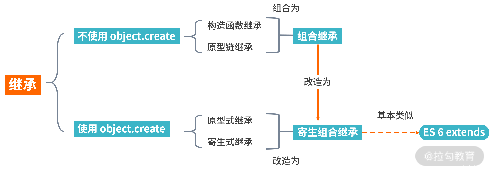

<!-- 
* 该文件是子目录的路由默认页
* 默认不显示目录，可以设置开启侧边栏的目录显示，该文件的目录会显示在侧边栏
* 侧边栏默认显示的一级目录，是通过根目录的_sidebar.md文件定义的。
* 嵌套目录显示是从二级目录开始的，subMaxLevel: 5 能够显示到四级目录
-->

# JavaScript
> [MDN](https://developer.mozilla.org/zh-CN/docs/Web/JavaScript) | [JavaScript 教程](https://wangdoc.com/javascript/) | [ES6 教程](https://wangdoc.com/es6/)

## 面向对象

* 面向对象是一种编程思想，或是一种编程模式。
* 面向对象不关注每一步元素应该做什么，而是关注对象本身能做什么。
* 比如你要吃面，不需要关注面的每一步制作流程，而只需要关注去哪吃面。

## 创建对象的方式
* 1 使用内置构造函数

```js
  var obj = new Object()
  obj.a = 2022;
  obj.b = 'hello world!'
```

* 2 使用字面量

```js
var obj1 = {
    name: 'tim',
    age: 20
}
```

* 3 使用工厂函数

```js
// 先定义一个函数
function factory() {
    // 手动创建一个对象
    var obj = new Object();
    // 手动添加属性
    obj.name = 'tim';
    obj.age = 22;
    // 手动返回这个对象
    return obj;
}
// 外部直接使用
var o1 = factory();
var o2 = factory();
```

* 4 使用自定义构造函数

```js
// 先定义一个函数
function Person(name, age) {
    // 自动创建一个对象，并赋值给this
    // 手动添加属性
    this.name = name;
    this.age = age;
    // 自动返回这个对象
}
// 外部使用时，需要与new连用
var f1 = new Person('tim', 22);
console.log(f1); // { name: tim, age: 22}
```

### 构造函数详解
* 构造函数与普通函数类似，之不过调用时需要与new连用
* 首字母用大驼峰命名
* 由于与`new`连用，构造函数的内部`this`，是指向当前实例
* 构造函数内部会自动返回一个对象，因此不需要写return

* 书写构造函数时，除了添加属性还可以添加方法
* 但每次new一个实例，同一个方法都会单独开辟一块空间
* 为解决这个问题，引入原型`prototype`

* 函数里`this`的指向，由调用方式决定的
    + 作为声明式函数调用：this ==> window
    + 作为定时函数调用: this ==> window
    + 作为事件函数调用: this ==> 事件源
    + 作为对象的方法调用: this ==> 调用方法的实例对象


### 原型prototype
* 原型的出现，是为了解决构造函数的缺点：同一个方法会占用多个内存
* 原型提供了一个给对象添加函数的方法，能够"合理"的为对象添加函数

* 每一个函数都拥有一个属性，叫`prototype`，是一个对象空间
* 因此构造函数也有这个`prototype`，对象空间
* 该对象空间，可以通过函数名访问，也可以向该空间添加属性、方法
* 在`prototype`中添加的内容，不是给函数用的，而是给实例使用的

```js
// 定义一个函数
function Person(name, age) {
    this.name = name;
    this.age = age;
}
// 在函数的原型上添加一个方法
Person.prototype.sleep = function() {
    console.log("人都需要睡觉，7-8小时为宜。");
}
// 使用构造函数
var p1 = new Person("tim", 22);
console.log(p1.name);   // tim
console.log(p1.age);    // 22
console.log(p1.sleep);  // 人都需要睡觉，7-8小时为宜。
```

### __proto__
* 每一个对象都有一个属性，叫`__proto__`，是一个对象空间
* 实例对象也会有`__proto__`，这个空间是指向该构造函数的`prototype`
* 当实例在访问某个属性/方法时，会从自身去查找。没找到会自动去`__proto__`找。
* 其实，`__proto__`的地址与构造函数的`prototype`的地址是同一个地址

* 在书写构造函数时：
    + 属性写在构造函数内
    + 方法写在原型上

### 原型链
* `__proto__`里面有一个成员叫做`constructor`
* `constructor`就是指向当前对象的所属的构造函数
* 当一个对象不知道是谁构造的，就认为是由`Object`构造的
* 所以，构造函数的`prototype`的`__proto__`指向的是`Object.prototype`
* `Object`是`js`中的顶级构造函数，万物皆对象
* 到`Object.prototype`时就到顶了，`Object.prototype.__proto__`结果是`null`
* 由此形成了一个链状结构，就是原型链

* 访问规则
    + 访问一个对象的属性或方法时，会先从自身找
    + 如果没有找到，会去`__proto__`里找
    + 如果还没找到，就回去`__proto__`的`__proto__`里面找
    + 一直找到`Object.prototype`里面都没有，那么就会返回`undefined`

* 赋值规则
    + 先在自身找，找到就修改属性的值
    + 没找到，就直接添加该属性与属性值
    + 不会去`__proto__`里

### 继承
* 继承指的是可以让子类使用父类的属性与方法

#### 原型继承
* 通过改变原型链的方式达到继承
* 将子类的原型指向父类的实例
* Child.prototype = new Father();
* 缺点：子类实例若修改了方法，会影响其他子类的方法，因为共用一个地址空间

```js
// 父类
function Person(name){
    this.name = name;
}
// 原型上有一个方法
Person.prototype.sayHi = function(){
    console.log('hello world')
} 
// 2 子类
function Student(age){
    this.age = age;
}
// 子类原型指向父类实例，就会拥有父类的属性与方法
Student.prototype = new Person('Jack');
// 再使用子类，就可以使用的父类的属性与方法
var s1 = new Student(18);
console.log(s1); 
```

#### 构造函数继承(基于call)
* 在子类的构造函数中，使用父类构造函数，并修改this指向到子类实例
* 使用call来改变函数内部this指向，call(子类实例，传递给函数的参数,...)
* 优缺点
    + 优点：可以将继承的属性直接写在自身
    + 缺点：
        - 只能继承父类函数体里的内容，不能继承父类原型上的内容
        - 一般指的是继承父类函数体里的属性，不能继承父类原型上的方法


```js
// 父类
function Person(name, gender){
    this.name = name;
    this.gender = gender;            
}
Person.prototype.sayHi = function(){
    console.log('hello world');
}
// 子类继承父类
function Student(age, name, gender){
    this.age = age;  // 子类自身的属性
    // 使用call将this指向当前实例，并传入父类的属性
    Person.call(this,name,gender); // 继承父类的属性
}
// 子类的实例对象，就会拥有父类的属性
var s1 = new Student(18, "小红", '女');
```


#### 组合继承
* 先使用构造函数继承，将属性继承到自身
* 再使用原型继承，将方法继承到自身
* 缺点：
    + 子类自身原型上的方法，会被覆盖
    + 必须要继承以后，再为子类添加原型方法

```js
// 父类
function Person(name, gender){
    this.name = name;
    this.gender = gender;            
}
Person.prototype.sayHi = function(){
    console.log('hello world');
}
//子类
function Student(age, name, gender){
    this.age = age;
    // 先继承属性
    Person.call(this,name,gender);
}
// 再继承方法
Student.prototype = new Person();
// 添加子类自身的方法
Student.prototype.fn = function(){
    console.log("子类自身的方法")
}
// 可以使用父类的属性与方法
var s2 = new Student(20, "小明", '男');
```

### ES6的类语法

```js
// 构造函数
function Human(name, age){
    this.name = name;
    this.age = age;
}
Human.prototype.eat = function(){
    console.log("一顿不吃饿得慌")
}
// ES6的类语法
class Human{
    // 函数体内部的属性
    constructor(name, age) {
        this.name = name;
        this.age = age;
    }
    // 原型上定义的方法
    eat(){
        console.log("一顿不吃饿得慌")
    }
    // static定义的静态属性 是给Human对象使用的
    static abc = 2022;
    static abcFn = function() {
        console.log("Hello abcFn");
    };
}
// 实例化
var h1 = new Human("小明", 20)
console.log(Human.aa);  // 使用静态属性
console.log(Human.abcFn);  // 使用静态方法
```

#### ES6的继承
* 可以使用`extends`关键字：`class Son extends Father{ }`
* 继承父类使用`super`关键字：`super(name, age);`，并且必须先写

```js
// 父类
class Father{
    constructor(name, age) {
        this.name = name;
        this.age = age;
    }
    sayHi() {
        console.log("Hello, my son!")
    }
}
// 子类
class Son extends Father{
    constructor(gender, name, age) {
        // 继承父类的属性，必须先写super
        super(name, age);
        this.gender = gender; 
    }
    sayHello() {
        console.log("Hello, my father!")
    }
}
// 实例有有父类的属性与方法
var s1 = new Son("男", "李磊", 22)
console.log(s1);
```





* 更多`JavaScript`总结，可以去看看[QA](/base/QA/)


>  [首页](/) | [HTML](/base/html/) | [CSS](/base/css/) | [JavaScript](/base/js/) | [QA](/base/QA/)
<hr>
<!-- 更新日期 -->

Powered by [docsify](https://docsify.js.org/) <span>|</span> 
Update: {docsify-updated} 